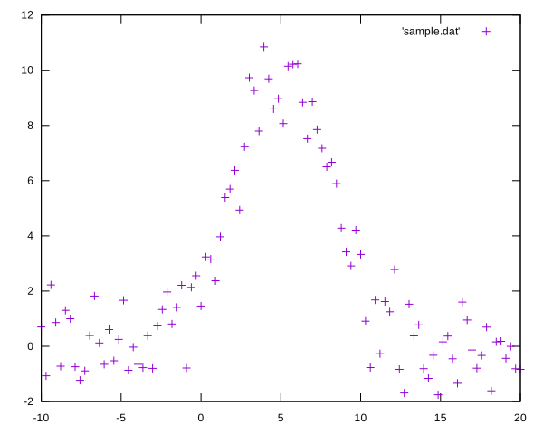
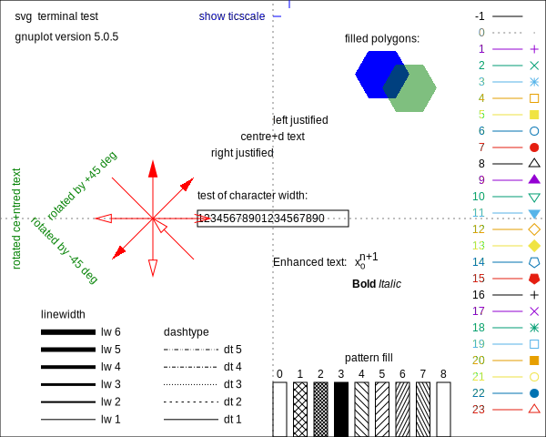
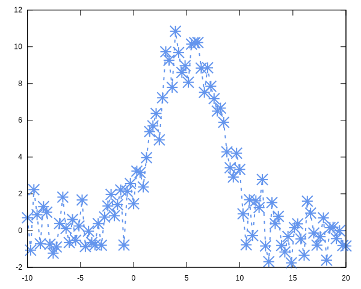
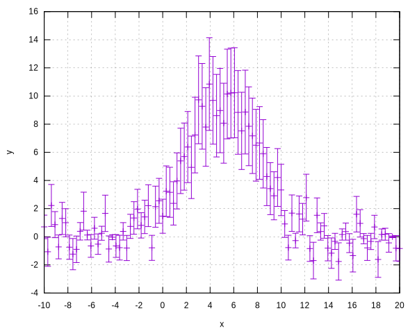
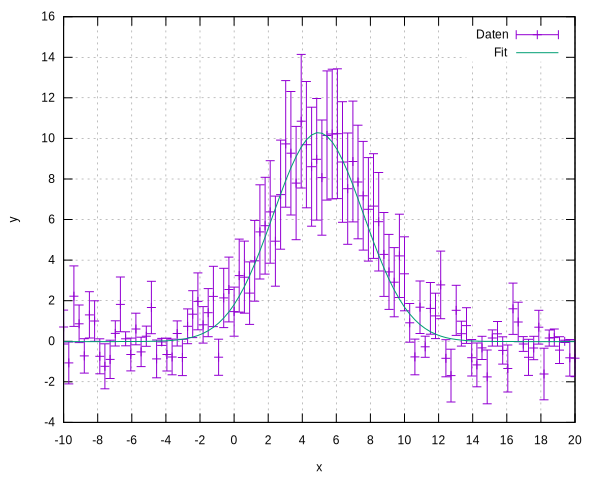
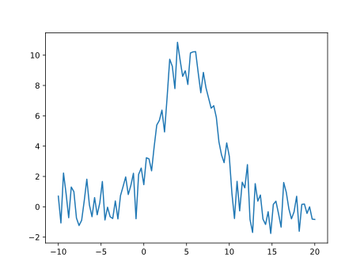
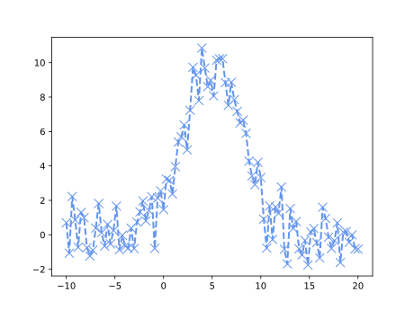
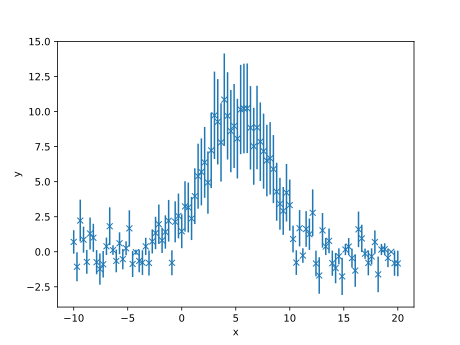
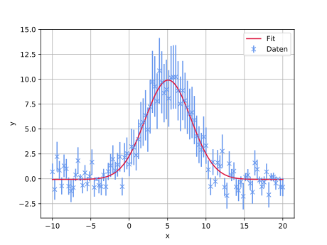

# Einführung in das Plotten und Fitten von Daten

## Mit gnuplot und matplotlib (Python)

__07.05.2018, Sebastian Schmidt (sebastian.seb.schmidt@fau.de)__

__[github.com/schmidtseb/RaspberryPiUebung]()__

---

## Python-modul: numpy
Das Modul *numpy* beinhaltet eine Vielzahl von wichtigen Funktionen, die der numerischen Verarbeitung und Erzeugung von Daten dienen. Beim Import wird häufig die Konvention benutzt, das Modul in den Namensbereich `np` zu laden:
```python
import numpy as np
```
Das Modul bietet häufig die Möglichkeit, einfache Lösungen für kompliziertere Probleme zu finden. Zudem benutzt es das Konzept der Vektorisierung, d. h. dem Anwenden von Operationen auf größere Datensätze. Aufgrund dessen und der Tatsache, dass ein großer Teil des Codes in C implementiert ist, können auch größere Berechnungen innerhalb kurzer Zeiten erfolgen.

### numpy-Arrays
Ein *numpy*-Array kann aus einer bereits bestehenden Liste instanziert werden:
```python
np.array(<Liste>)
```
Die dabei verwendete Liste kann eine beliebige Dimension besitzen, wobei Eindimensionalität als Vektor und Mehrdimensionalität als Matrix interpretiert werden kann. Dies führt dann zu folgenden Rechenregeln:
- Die Multiplikation/Addition eines Skalars (d.h. einer *integer*- oder *float*-Variable) mit einem Array führt zur Multiplikation/Addition eines jeden Elements des Arrays mit dem Skalar
- Die Multiplikation/Addition von zwei Arrays ist nur dann erlaubt, wenn diese die gleiche Dimensionalität besitzen. In diesem Fall wird jedes Element des einen Arrays mit dem entsprechenden Element des anderen Arrays multipliziert/addiert
- Die letzte Operation darf nicht mit dem Skalarprodukt verwechselt werden, welches über `np.dot()` ausgeführt werden kann. Das Kreuzprodukt ist über die Funktion `np.cross()` implementiert

#### Beispiele
Umrechnen eines Datensatzes, bestehend aus Verhältnissen, gespeichert in Liste `d`, in Prozent:
- Ohne numpy:
  ```python
  new_d = []
  for item in d:
  	new_d.append( item * 100 )
  d = new_d
  ```

- Mit numpy:
  ```python
  d = np.array(d) * 100
  ```


### Zugriff auf numpy-Arrays

Die Indizes eines Arrays, anders als bei einer Liste, können mit einem Komma getrennt werden. Wird statt einer Zahl ein Doppelpunkt `:` angegeben, so werden alle Elemente dieser Dimension selektiert. 
Möchte man eine bestimmte Spalte aus einem Array `A` auslesen, so kann dies über die Angabe ihres Index (__Vorsicht__: Zählung beginnt bei 0!) geschehen: 

```python
A[:, <Spalten-Index>]
```

#### Beispiele

```python
A = np.array( [[1, 2], [3, 4], [5, 6]] )
print A[:, 0]
> array([1, 3, 5])
print A[1]
> array([3, 4])
print A[1, :]
> array([3, 4])
print A([2, 1])
> 6
```

### Erzeugung von äquidistanten Zahlen via np.linspace()
Die Funktion `np.linspace()` erzeugt linear eine vorgegebene Anzahl von Zahlen innerhalb eines vorgegebenen Intervalls. Der Funktionsaufruf hat dabei die folgenden Form:
```python
np.linspace(<min>, <max>, <Anzahl>)
```

#### Beispiel
```python
print np.linspace(3.2, 9.7, 10)
> [3.2        3.92222222 4.64444444 5.36666667 6.08888889 6.81111111
   7.53333333 8.25555556 8.97777778 9.7 ]
```

### Mathematische Funktionen

*numpy* stellt eine ganze Reihe an mathematischen Funktionen zur Verfügung. Im Gegensatz zu Funktionen aus dem `math`-Modul können hierbei Arrays als Eingangsgrößen verwendet werden. Dies kann benutzt werden, um beispielsweise die Datenpunkte der Sinusfunktion zu berechnen:
```python
x = np.linspace(0, 2*np.pi, 10000)
y = np.sin(x)
```

Im weiteren Verlauf wird genau diese Arbeitsweise benutzt, um Daten zu plotten.

## Erzeugung von Beispieldaten
In den folgenden Abschnitten werden Beispieldaten benutzt, die über folgendes Python-Skript erzeugt werden können und in der Datei `sample.dat` gespeichert werden:
```python
import numpy as np

def normal(x, A, mu, sigma):
	return A*np.exp(-(x - mu)**2 / (2*sigma**2))

A = 10		# Amplitude
mu = 5		# Mittelwert
sigma = 3	# Standardabweichung
N = 100		# Anzahl der Datenpunkte

x = np.linspace(mu-5*sigma, mu+5*sigma, N)
y = normal(x, A, mu, sigma) + np.random.normal(0, 1, N)

f = open('sample.dat', 'w')
for i in range( len(x) ):
	f.write(str(x[i]) + '\t' + str(y[i]) + '\n')
f.close()
```
Hierbei wird auf eine Gaußverteilung normalverteiltes Rauschen addiert.

---

## gnuplot

Ebenso wie Python, bietet *gnuplot* die Möglichkeit es in einer interaktiven Session zu benutzen. Dabei wird das Programm über die Eingabe von `gnuplot` im Terminal gestartet, woraufhin der Command Prompt in folgender Form erscheint:
```
gnuplot>
```

Eine solche Session erlaubt die schnelle Betrachtung von Daten oder das Testen bestimmter Funktionen. Komplexere Auswertungen sollten dabei jedoch stets in ein eigenes Skript geschrieben werden.

### Scatter-Plot
Ein Datenfile in *gnuplot* muss die folgende Form besitzen:
- Kommentare werden mittels `#` dargestellt
- Die Daten befinden sich in Spalten, wobei auch mehr als zwei Spalten zulässig sind
- Die Spalten selbst werden standardmäßig über Tabulatoren oder Leerzeichen getrennt. Es existiert die Möglichkeit andere Trennzeichen zu benutzen, die über eine Einstellung vorgegeben werden können (`set datafile separator`)

Der `plot`-Befehl stellt die zentrale Funktion in einem *gnuplot*-Skript dar. In seiner simpelsten Form sieht es wie folgt aus:
```gnuplot
plot '<Dateiname>'
```

Es wird ein sog. Scatter-Plot erzeugt. Dabei wird die erste Spalte in der angegebenen Datei als x-Komponente und die zweite Spalte als y-Komponente des Datensatzes verwendet. Zusätzlich wird ein Label erzeugt, das den Namen der Datei trägt. Die Skalierung der Achsen erfolgt automatisch. Für die Beispieldaten führt dies zu folgendem Plot:



Über das Keyword `using` (kurz: `u`) kann angegeben werden, welche Spalten im angegebenen Datenfile gegeneinander geplottet werden sollen. Standardmäßig ist x die erste und y die zweite Spalte. Wird als Index der Wert `0` angegeben, so wird der Index der Daten auf der Achse dargestellt. Folgendes Beispiel zeigt, wie die Spalten 1 und 3 gegeneinander geplottet werden können:

```gnuplot
plot '<Dateiname>' using 1:3
```


Möchte man eine Funktion auf die eingelesenen Daten anwenden, so kann dies über den Operator `$` geschehen. Um beispielsweise die Wurzel der zweiten Spalte gegen die erste Spalte aufzutragen, wird folgender Befehl verwendet:

```gnuplot
plot '<Dateiname>' using 1:(sqrt($2))
```

Die Klammern um die Wurzelfunktion sind hierbei notwendig!


Sollen mehrere Datensätze gleichzeitig geplottet werden, so werden diese innerhalb des `plot`-Befehls mit einem Komma abgetrennt:

```gnuplot
plot <Dateiname1>, <Dateiname2>
```


Wird eine Kommandozeile zu lang, so kann sie zur besseren Lesbarkeit mittels eines Backslashs geteilt werden. Beispiel:

```gnuplot
plot <Dateiname1>,\
	<Dateiname2>
```

### Einstellungen

#### Optionen des plot-Befehls

Optionen werden innerhalb des Plot-Befehls nach dem Keyword `with` (kurz: `w`) angegeben. Die wichtigsten Einstellungen sind hierbei:

- `points` (kurz: `p`): Scatter-Plot
- `lines` (kurz: `l`): Line-Chart
- `linespoints` (kurz: `lp`): eine Kombination aus Scatter- und Line-Chart

Die Form der dargstellten Punkte und Linien kann zusätzlich über die folgenden Optionen modifiziert werden. Die verschiedenen Einstellmöglichkeiten sind im dazugehörigen Bild dargstellt. Dieses kann in *gnuplot* über das Kommando `test` angezeigt werden.

- `pointtype` (kurz: `pt`): Form der dargestellten Punkte in einem Scatter-Plot
- `pointsize` (kurz: `ps`): Größe der Punkte im Plot
- `linetype` (kurz: `lt`): Form der dargestellten Lines. Obsolet in neueren gnuplot-Versionen, da von der `dashtype`-Option abgelöst
- `dashtype` (kurz: `dt`): Form der dargestellten Lines, d.h. durchgängig bzw. verschiedene Möglichkeiten an gestrichelten Linien 
- `linewidth` (kurz: `lw`): Breite der dargestellten Lines
- `linecolor` (kurz: `lc`): Farbe der dargstellten Lines und Punkte. Angabe entweder als Index, als Keyword (z.B. `blue`) oder als hexadezimaler RGB-Code (z.B. `'#123456'`)
- `title` (kurz `t`): Name des Datensatzes, der in der Legende des Plots dargestellt wird. Bei nur einem einzelnen Plot sollte dieser Wert leer sein, d.h. `title ''`



Die Optionen können hierbei direkt hinter dem `with`-Keyword stehen oder als *linestyle* definiert werden. Dies erfolgt über

```gnuplot
set style line <Nr. des Styles> <Optionen>
```

Im Plot wird der entsprechende Style dann über 

```gnuplot
plot '<Dateiname>' with linestyle <Nr. des Styles>
```

bzw. in kurzer Form über

```gnuplot
plot '<Dateiname>' w ls <Nr. des Styles>
```

eingesetzt.


Nachfolgend ein Beispiel mit dem Beispieldatensatz:

```gnuplot
set style line 1 pointtype 18 pointsize 2 dashtype 2 linewidth 2 linecolor '#6495ED'
plot 'sample.dat' with linespoint linestyle 1 title ''
```

oder in Kurzschreibweise:

```gnuplot
set style line 1 pt 18 ps 2 dt 2 lw 2 lc '#6495ED'
plot 'sample.dat' w lp ls 1 t ''
```



Dies ist ledglich ein Beispiel, da optisch noch Optimieriungsbedarf besteht!

#### Setzen eines Titels

Ein Titel, dargestellt am oberen Rand des Plots, wird über

```gnuplot
set title '<Titel>'
```

festgelegt.

#### Setzen von Achsen-Labels

Mittels `set xlabel` und `set ylabel` können die an den Achsen darzustellenden Labels angegeben werden. Diese sollten zum einen die geplottete Variable, sowie deren Einheit enthalten. 

```gnuplot
set xlabel '<Label>'
set ylabel '<Label>'
```

#### Setzen von Achsen-Ticks

Via `set xtics` und `set ytics` können die Abstände der Ticks und damit ihre Werte auf den Achsen gesetzt werden. Als Argument wird hierbei der geforderte Abstand eingesetzt:

```gnuplot
set xtics <Tick-Abstand>
set ytics <Tick-Abstand>
```

#### Setzen von Achsenlimits

Über die Befehle `set xrange` und `set yrange` kann der im Plot dargestellte Ausschnitt gesetzt werden. Die Angabe der Grenzen erfolgt hierbei in der folgenden Weise

```gnuplot
set xrange [<xmin>:<xmax>]
set yrange [<ymin>:<ymax>]
```

#### Logarithmische Skalierung

Die Achsen des Plots können in logarithmischer Form dargstellt werden. Dies erfolgt über die Befehle `set log x` bzw. `set log y`, wobei eine Kombination aus beiden Befehlen möglich ist.

#### Darstellung eines Grids

Ein Gitternetz kann über die Option `set grid` angeschaltet werden. 

#### Fehlerbalken

Möchte man fehlerbehaftete Daten in einem Plot darstellen, so kann dies über die Keywords `xerrorbars`, `yerrorbars` bzw. `xyerrorbars` erfolgen. Dabei müssen die Fehlerdaten über das Keyword `using` (kurz: `u`) angegeben werden. Befinden sich die x-Daten in Spalte 1, die y-Daten in Spalte 2 und deren Fehler in Spalte 3, so können diese über

```gnuplot
plot '<Dateiname>' u 1:2:3 with yerrorbars
```

dargestellt werden. Die Fehler können auch direkt aus den Daten berechnet werden. Dies ist z.B. bei poissonverteilten Werten sinnvoll, wobei der Fehler bei $N$ Ereignissen $\sqrt N$ beträgt. Ein Beispiel anhand des Beispieldatensatzes:

```gnuplot
set xlabel 'x'
set ylabel 'y'
set xtics 2
set grid

plot 'sample.dat' using 1:2:(sqrt(abs($2))) with yerrorbars title ''
```




### Ausgabe in Datei

Durch das Setzen eines Terminals kann die Ausgabe des Plots direkt in eine Datei erfolgen. Über `set term` können die verfügbaren Terminals angezeigt werden. Schließlich wird mittels desselben Befehls das gewünschte Terminal selektiert. Ein Beispiel ist der Export als pdf-File:

```gnuplot
set term pdfcairo {{no}enhanced} {mono|color} {solid|dashed}
                          {font <font>}
                          {linewidth <lw>} {rounded|butt} {dashlength <dl>}
                          {size <XX>{unit},<YY>{unit}}
```

Die Optionen in den geschweiften Klammern sind optional. Sie stellen verschiedene Parameter dar, um das Aussehen des Plots zu modifizieren. Eine Erklärung ihrer Funktionen findet sich unter:

http://www.phy.ntnu.edu.tw/demolab/html.php?html=doc/gnuplot-doc/html/pdfcairo

### Darstellung von Funktionen

Funktionen können in gnuplot analog zu ihrer mathematischen Form definiert werden. Möchte man beispielsweise einen allgemeinen, exponentiellen Zerfall verwenden, so kann dieser mittels

```
f(x) = A*exp(-x/T) + b
```

deklariert werden. Er trägt dann den Funktionsnamen `f` und besitzt `x` als Eingangsgröße. Die Parameter `A`, `T` und `b` können zum einen global definiert werden (z.B. `A = 5`) oder der Funktion übergeben werden. Diese muss dann jedoch neu definiert werden:

```gnuplot
f(x, A, T, b) = A*exp(-x/T) + b
```

Möchte man diese Funktion nun plotten, kann dies über

```gnuplot
plot f(x, <Wert von A>, <Wert von T>, <Wert von b>)
```

erfolgen, wobei die Werte für die verschiedenen Parameter eingesetzt, bzw. global definiert werden müssen.

### Regression von Daten

Die Regression der Parameter $\vec \alpha$ einer vorgegebenen Funktion $f$ an einen Datensatz $(\vec x,\, \vec y)$ erfolgt in Gnuplot über die Minimierung der Summe der kleinsten Quadrate:

$$ \sum_{i=1}^n \left(f(x_i,\, \vec \alpha) - y_i \right)^2.$$

Im Folgenden wird der Fit an die Beispieldaten aus `sample.dat` präsentiert. Es ist bekannt, dass es sich hierbei um einen verrauschten, gaußverteilten Datensatz handelt. Daher muss zuerst die Fit-Funktion definiert werden:

```gnuplot
f(x) = A*exp(-(x-mu)**2/(2*sigma**2)) + b
```

Die Parameter `A`, `mu`, `sigma` und `b` können nun auf Startwerte gesetzt werden. Dies ist oftmals sehr hilfreich, da der Fit damit schneller bzw. überhaupt konvergiert:

```gnuplot
A = 9.2
mu = 3.2
sigma = 2.
b = 0.1
```

Die eigentliche Regression findet dann über das Kommando

```gnuplot
fit f(x) 'sample.dat' via A, mu, sigma, b
```

statt. Über das Keyword `via` werden die Parameter angegeben, die im Fit optimiert werden sollen. Diese sind nach dem Durchlauf der Routine auf den finalen Wert der Regression gesetzt. Durch das Keyword `using` kann, wie zuvor auch, eine dritte bzw. vierte Spalte mit Fehlerwerten angegeben werden. Diese Fehler werden dann bei Angabe von `xerrors`, `yerrors` bzw. `xyerrors` währrend des Fits berücksichtigt:

```gnuplot
fit f(x) 'sample.dat' u 1:2:(sqrt(abs($2))) yerrors via A, mu, sigma, b
```

Konvergiert der Fit, so werden die finalen Parameterwerte, deren Fehler und Korrelationen zueinander, sowie der $\chi^2$-Wert angezeigt. Bei nicht erfolgreichem Fit, sollte dieser mit neuen Startwerten wiederholt werden. 

Ergebnis des Fits an die Beispieldaten, dargestellt über:

```gnuplot
plot 'sample.dat' u 1:2:(sqrt(abs($2))) w yerrorbars t 'Daten', f(x) t 'Fit'
```



---

## Python: matplotlib

Python besitzt dank des Moduls *matplotlib* eine vergleichbare Funktionalität wie gnuplot. Dies ist oftmals sehr praktisch, da die Datenverarbeitung und deren Darstellung im selben Programm stattfinden kann. Die für das Plotten wichtigen Unterfunktionen von `matplotlib` sind hierbei im Unterbereich `pyplot`  zu finden. Die Konvention das Modul zu importieren ist hierbei

```python
import matplotlib.pyplot as plt
```

### Einlesen von Daten

numpy bietet über den Befehl `genfromtxt()` eine einfache Möglichkeit zum Einlesen tabellierter Daten. Nachfolgend werden die Beispieldaten aus `sample.dat` gelesen und als Array ausgegeben. Über den Zugriff auf den Index werden die entsprechenden Spalten in eigene Variablen eingelesen:

```python
d = np.genfromtxt('sample.dat')
x = d[:, 0]
y = d[:, 1]
```

### Scatter-Plot/Line-Chart

Das Plotten der eingelesenen Daten findet über die Funktion

```python
plt.plot(x, y)
```

statt. Das resultierende Bild kann über

``` python
plt.show()
```

auf dem Bildschirm ausgegeben werden oder über

```python
plt.savefig('<Dateiname>')
```

als Bild gespeichert werden.

Standardmäßig hat das Bild die folgende Form: 



#### Optionen des plot-Befehls

Über das Setzen von Parametern kann die gewünschte Form des Plots erreicht werden. Ein Parameter wird dabei in folgender Weise gesetzt:

```python
plt.plot(x, y, <Parametername>=<Wert>)
```

Mehrere Parameter werden über Komma getrennt angegeben.

Wird die `plt.plot()`-Funktion mehrfach ausgeführt, so wird jedes Mal ein neuer Datensatz mit einer neuen Farbe in den Plot eingefügt. Der Parameter `label` kann gesetzt werden, um die Datensätze später mittels einer Legende auseinanderzuhalten.

Über `fmt` kann ein String der Form 

```python
fmt = '[color][marker][line]'
```

angegeben werden. Jedes der Attribute besteht dabei aus einem Zeichen, d.h. z.B. `'b'` für die Farbe blau, `o` für runde Punkte und `--` für gestrichelte Linien. Siehe: https://matplotlib.org/api/_as_gen/matplotlib.pyplot.plot.html für eine Auflistung der verfügbaren Optionen

Andere wichtige Parameter sind:

- `linestyle` (kurz: `ls`): Form der Linien. Möglichkeiten: `solid` (`-`), `dashed` (`--`), `dashdot` (`-.`) und `dotted` (`:`). Möchte man keine Linien, wie bei einem reinen Scatter-Plot, so muss der Parameter auf `''` gesetzt werden
- `linewidth` (kurz: `lw`): Breite der Linie
- `marker`: Form der Punkte
- `markersize` (kurz: `ms`): Größe der Punkte
- `color` (kurz: `c`): Farbe der Linien und Punkte. Angabe erfolgt über den Namen der Farbe oder über einen RGB-Code (z.B. '`#123456`')

Beispiel mit Beispieldaten:

```python
plt.plot(x, y, ls='--', lw=2, ms=10, marker='x', color='cornflowerblue')
```



#### Setzen eines Titels

Ein Plottitel, dargestellt am oberen Rand des Plots, kann über den Befehl

```python
plt.title('<Titel>')
```

festgelegt werden.

#### Setzen von Achsen-Labels

Die Labels an den Achsen des Plots können mittels folgender Befehle gesetzt werden:

```python
plt.xlabel('<Label>')
plt.ylabel('<Label>')
```

#### Setzen von Achsenlimits

Der darzustellende Bereich des Plots kann über die Funktionen

```python
plt.xrange(<xmin>, <xmax>)
plt.yrange(<ymin>, <ymax>)
```

eingegrenzt werden.

#### Logarithmische Darstellung

Anders als bei *gnuplot* werden die Achsen nicht als logarithmisch gesetzt, sondern eine eigene Plot-Funktion dafür verwendet:

```python
plt.semilogx(x, y)	# Logarithmische x-Achse
plt.semilogy(x, y)	# Logarithmische y-Achse
plt.loglog(x, y)	# x- und y-Achse logarithmisch
```

#### Darstellung eines Grids

Die Darstellung eines Gitternetzes wird über 

```python
plt.grid()
```

aktiviert. 

#### Darstellung einer Legende

Wurde beim Plotten von Datensätzen deren Name mittels dem Parameter `label` festgelegt, so kann eine Legende erstellt werden, die die jeweilige Information der Datensätze beinhaltet. Dies geschieht über

```python
plt.legend()
```

Als Parameter kann zusätzlich der Ort der Legende festgelegt werden. Hierbei empfiehlt es sich den Wert `'best'` zu wählen, wobei die Legende automatisch an einen Ort platziert wird, an dem sie Platz hat.

#### Fehlerbalken

Fehlerbalken können über die Funktion `plt.errorbar()` dargestellt werden. Die Daten der x- und y-Fehler werden hierbei den Parametern `xerr` bzw. `yerr` übergeben. 

Wählt man, wie vorher in *gnuplot* auch, einen Wurzel-Fehler auf die Beispieldaten, so können diese über

```python
plt.errorbar(x, y, yerr=np.sqrt(np.abs(y)), ls='', marker='x')
```

dargestellt werden:



### Darstellung von Funktionen

Die Definition von Funktionen in Python ist bereits bekannt. Anders als bei gnuplot müssen die Datenpunkte nun jedoch selbst erzeugt werden. D.h. über `np.linspace()` werden die Punkte auf der x-Achse generiert und dann in eine vorher definierte Funktion eingesetzt, um die entsprechenden y-Werte zu erhalten. Anschließend werden die Wertepaare, wie bereits beschrieben, geplottet.

### Regression von Daten

Um einen Fit an die Daten vorzunehmen, muss vorher eine Annahme über deren funktionalen Verlauf gemacht werden. Im Falle der Beispieldaten ist dies eine Gaußverteilung, d.h.:

```python
def normal(x, A, mu, sigma, b):
	return A*np.exp(-(x - mu)**2 / (2*sigma**2)) + b
```

Für die eigentliche Regression wird eine Funktion des `scipy`-Moduls verwendet. Benötigt wird dabei lediglich die Funktion `optimize.curve_fit`, die über 

```python
from scipy.optimize import curve_fit
```

importiert wird.

Anschließend wird der Fit über folgenden Funktionsaufruf gestartet:

```python
popt, pcov = curve_fit(normal, x, y, p0=[9.2, 3.2, 2., 0.1])
```

Angegeben werden der Funktionsname, die x- und y-Werte, sowie die optionalen Startparameter `p0`. Zurückgegeben werden die optimierten Parameter der angegebenen Funktion, sowie deren Korrelationsmatrix. Die Fehler auf die Parameter können über

```python
perr = np.sqrt(np.diag(pcov))
```

berechnet werden.

Möchte man die gewählte Funktion mit optimierten Parametern darstellen, so müssen zuerst Datenpunkte erstellt werden. Die Anzahl der x-Werte sollte dabei hoch gewählt werden, da sonst Artefakte im Plot sichtbar sind:

```python
xFit = np.linspace(min(x), max(x), 10000)
yFit = normal(xFit, *popt)
```

Der Stern-Operator `*` entpackt hierbei die Werte in `popt` und übergibt sie der Funktion `normal`.

Abschließend können Daten, sowie Fitdaten, in einem gemeinsamen Plot dargestellt werden:

```python
plt.errorbar(x, y, yerr=np.sqrt(np.abs(y)), ls='', marker='x',
             color='cornflowerblue', label='Daten')
plt.plot(xFit, yFit, ls='-', color='crimson', label='Fit')
plt.xlabel('x')
plt.ylabel('y')
plt.grid()
plt.legend()
```

